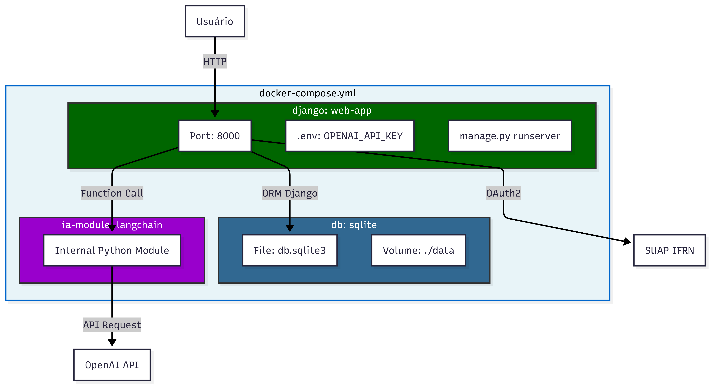
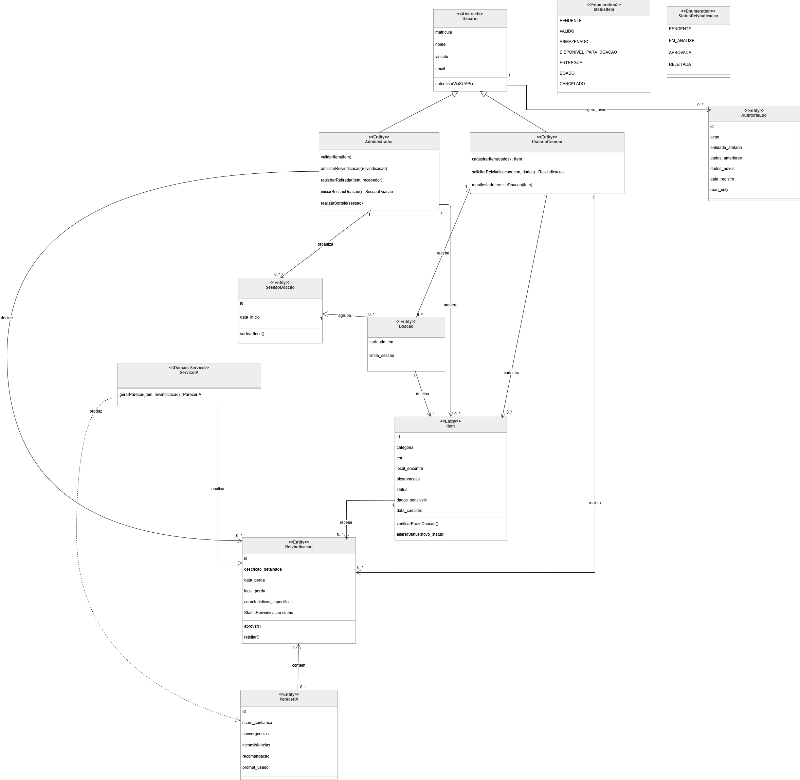

# Architecture Decision Record (ADR)

É um documento técnico, curto e estruturado, utilizado no desenvolvimento de software para registrar uma decisão importante sobre a arquitetura do sistema.

## Decisão técnica

**Status:** Em revisão. \
A arquitetura do sistema será baseada no framework Django (Python), utilizando PostgreeSQL para persistência dados e orquestração via Docker.


### Justificativa
O Django, sendo baseado em Python, oferece a melhor integração com as bibliotecas das APIs de IA (OpenAI/Gemini), facilitando o uso de Few-shot prompting e Function Calling.
Além disso, possui suporte robusto para a integração com o provedor de identidade do SUAP (OAuth2).\
O padrão MVT (Model-View-Template) permite a criação rápida de interfaces responsivas e do formulário de reivindicação.\
Por fim, a stack permite a criação de um ambiente "plug-and-play", onde o sistema pode ser iniciado com um único comando, conforme as exigências de infraestrutura do projeto

---

# SUMÁRIO

1. [Diagrama de contexto (C4 - Nível 1)](#diagrama-de-contexto-c4---nível-1)
2. [Diagrama de Container (C4 - Nível 2)](#diagrama-de-container-c4---nível-2)
3. [Diagrama de Componentes (C4 - Nível 3)](#diagrama-de-componentes-c4---nível-3)
4. [Diagrama de Classes](#diagrama-de-classes)
5. [Modelo Entidade-Relacionamento (MER)](#modelo-entidade-relacionamento-mer---persistência-postgresql)
6. [Diagrama de Sequência - Fluxo de Reivindicação com IA](#diagrama-de-sequência---fluxo-de-reivindicação-com-ia)
7. [Diagrama de Infraestrutura Docker](#diagrama-de-infraestrutura-docker)
8. [Diagrama de domínio](#diagrama-de-domínio)

---

## Diagrama de contexto (C4 - Nível 1)
> O Diagrama de Contexto é uma representação de alto nível que define as fronteiras do sistema. Ele **detalha** como o CADÊ **interage com os usuários** (Alunos, Servidores e Administradores) e com sistemas externos, como o SUAP para autenticação e as APIs de IA para validação.


```mmd
C4Context
    title Diagrama de Contexto - Sistema CADÊ

    direction right

    // Users
    Usuario comum [icon: user, color: blue]

    Administrador COAPAC [icon: user-check, color: blue]

    // Main System
    Sistema CADE [icon: box, color: orange] {
    CADE [icon: search, label: "CADÊ - Sistema de Achados e Perdidos com IA"]
    }

    // External Systems
    SUAP [icon: key, label: "SUAP - Sistema de Autenticação OAuth2 do IFRN"]
    API de IA Generativa [icon: openai, label: "API de IA Generativa (OpenAI/Gemini)"]

    // Connections
    Usuario comum> CADE: Autentica, consulta, cadastra e reivindica [color: black]

    Administrador COAPAC > CADE: Gerencia, valida, sorteia e audita [color: black]
    CADE <> SUAP: OAuth2 - Autenticação Institucional [color: gray]
    CADE <> API de IA Generativa: Function Calling - Validação de Reivindicações [color: gray]
```
---

## Diagrama de Container (C4 - Nível 2)
> O Diagrama de Container descreve a arquitetura lógica e a distribuição das responsabilidades tecnológicas. Ele apresenta como o sistema é dividido em **unidades executáveis** (Frontend, Backend, Banco de Dados e Módulo de IA) e como essas **partes se comunicam entre si** dentro do ambiente Docker.


```mmd
C4Container
    title Diagrama de Container - Sistema CADÊ

    // Users
    Aluno Servidor [icon: user, label: "Aluno/Servidor", color: blue]
    Administrador COAPAC [icon: user-check, label: "Administrador COAPAC", color: blue]

    // Main System
    Sistema CADE [icon: docker, label: "Sistema CADÊ [Docker]"] {
        Frontend Django Templates [icon: monitor, label: "Frontend Django Templates"]
        Backend Django [icon: server, label: "Backend Django"]
        Banco PostregreSQL [icon: database]
        Modulo de IA [icon: cpu, label: "Módulo de IA"]
    }

    // External Systems
    SUAP OAuth2 [icon: lock, label: "SUAP OAuth2", color: black, colorMode: bold]
    OpenAI API [icon: openai, label: "OpenAI API"]

    // Connections
    Aluno Servidor > Frontend Django Templates: Acessa via navegador HTTP
    Administrador COAPAC > Frontend Django Templates: Acessa via navegador HTTP
    Frontend Django Templates <> Backend Django: Request/Response MVT
    Backend Django <> Banco PostregreSQL: ORM
    Backend Django <> Modulo de IA: Chamada de função interna Python
    Modulo de IA <> OpenAI API: API Request/Response
    Backend Django <> SUAP OAuth2: OAuth2 Flow
```

---

## Diagrama de Componentes (C4 - Nível 3)
> O Diagrama de Componentes detalha a **organização interna do Backend** Django. Ele **identifica os módulos principais (Apps)** do sistema, como o gerenciamento de itens, o motor de sorteios e o serviço de auditoria, evidenciando as interações com o banco de dados e sinais internos do framework.


```mmd
C4Component
    title Diagrama de Componentes - Backend Django CADÊ

    direction down

    Backend Django [icon: server, label: "Backend Django (Python)", color: white] {
        Auth Module [icon: lock, label: "Auth Module", color: green]
        Items App [icon: package, label: "Items App", color: green]
        Claims App [icon: clipboard, label: "Claims App", color: green]
        Donation App [icon: gift, label: "Donation App", color: green]
        AI Service [icon: openai, label: "AI Service", color: purple]
        Audit Logger [icon: file-text, label: "Audit Logger", color: orange]
        PostegreSQL Database [icon: database, label: "PostgreSQL Database", textSize: small]
    }

    // Database connections
    Auth Module <> PostegreSQL Database: Consulta/Atualiza usuário
    Items App <> PostegreSQL Database: ORM - CRUD de itens
    Donation App <> PostegreSQL Database: Gerencia sorteios e limites
    Audit Logger <> PostegreSQL Database: Grava logs read-only

    // AI connections
    Claims App > AI Service: Solicita análise de posse [color: purple]
    AI Service > PostegreSQL Database: Registra parecer_ia [color: purple]

    // Audit signal connections
    Items App > Audit Logger: Signal post_save auditoria [color: orange]
    Claims App > Audit Logger: Signal post_save auditoria [color: orange]
    Donation App > Audit Logger: Signal post_save auditoria [color: orange]

    legend {
        [connection: "<>", label: "Bidirectional data flow"]
        [connection: ">", color: purple, label: "AI integration"]
        [connection: ">", color: orange, label: "Audit signal"]
    }

```
---

## Diagrama de Classes
> O Diagrama de Classes descreve a estrutura estática e o modelo de dados do sistema. Ele define as **entidades** (Usuário, Item, Reivindicação, etc.), seus **atributos** e os **relacionamentos lógicos** (como herança e associação), garantindo que as regras de negócio e requisitos de integridade sejam respeitados.


```mmd
---
config:
  layout: dagre
  theme: default
  look: handDrawn
---
classDiagram 


    class UsuarioComum {
        - string matricula
        + cadastrarItem(dados) Item
        + editarItem(id, dados) void
        + cancelarItem(id) void
        + solicitarReivindicacao(id, evidencias) Reivindicacao
        + manifestarInteresse(item_id) void
 
    }

    class Administrador {
        + validarItem(item_id) void
        + confirmarEntrega(item_id) void
        + gerenciarSessaoDoacao() void
        + realizarSorteio(doacao_id) void
        + registrarRetirada(item_id, recebedor) void
        + consultarLogAuditoria() List
        + concederAdministracao(usuario_id) void

    }


    class StatusItem {
        <<enumeration>>
        PENDENTE
        DISPONIVEL_PARA_DOACAO
        CANCELADO
        ARMAZENADO
        ENTREGUE
        SORTEADO_AGUARDANDO_ENTREGA
        DOADO
        VALIDO
    }

    class Item{
        - int id
        - ImageField imagem
        - string descricao
        - string cor
        - string local_encontrado
        - boolean dados_sensiveis
        - StatusItem status_atual
        - timestamp data_encontro
        - timestamp data_despacho
        + verificarPrazoDoacao() boolean
        + atualizarStatus()

    }

    class Usuario{
        - int id
        - string nome
        - date data_criacao
        +autenticarViaSUAP()
    }

    class Doacao{
        - int id
        - date sorteado_em
        + sortearItem()  UsuarioComum
    }

    class SessaoDoacao{
        - int id
        - timestamp data_inicio
        - timestamp data_fim
        + iniciar()
        + finalizar()
        + filtrarElegiveis(usuarios) List
        + listarItensDisponiveis() List<Item>
    }

    class StatusReivindicacao {
        <<enumeration>>
        PENDENTE
        EM_ANALISE
        NEGADA
        APROVADA
        
    }

    class Reivindicacao{
        - int id
        - string motivo
        - date data_perda
        - string local_perda
        - string caracteristicas_especificas
        - StatusReivindicacao status
        - date data_decisao
        + processarAnalise(decisao, justificativa) void
        
    }

    class ServicoIA{
        <<service>>
        + gerarParecer()
        + atualizarConfianca()

    }

    class ParecerIA{
        - int id
        - float score_confianca
        - JSON convergencias
        - JSON inconsistencias
        - string recomendacao
        - string prompt
        - date data_criacao
        - date data_prompt
        + ObterParecer()
        + AtualizarPrompt()
        + gerarAnalise(reivindicacao) ParecerIA

    }

    class Auditoria{
        <<read only>>
        - int id
        - string acao
        - string entidade_tipo
        - int entidade_id
        - JSON dados_anteriores
        - JSON dados_novos
        - date data_criacao
        - date data_atualizacao
    }


    Usuario <|-- UsuarioComum
    Usuario <|-- Administrador
    Usuario "1" --> "0..*" Auditoria : gera_registro

    
    UsuarioComum "1" <--> "0..*" Item : cadastra
    UsuarioComum "1" <--> "0..*" Reivindicacao : solicita
    UsuarioComum "1" <--> "0..*" Doacao : vence/participa

    Administrador "1" <--> "1..*" SessaoDoacao :conduz
    Administrador "1" <--> "0..*" Reivindicacao : analisa
    Item "1" .. "1" StatusItem : possui
    Item "1" <--> "0..*" Reivindicacao : possui

    Reivindicacao "1" .. "1" StatusReivindicacao : possui
    Reivindicacao "1" <--> "1" ParecerIA :contém
    Reivindicacao <.. ServicoIA : depende
    

    SessaoDoacao "1" <--> "1..*" Doacao :agrupa

    Doacao "1" <--> "1" Item : sorteado

    ServicoIA --> ParecerIA
    


    class SistemaCADE {
        <<facade>>
        +autenticar(matricula) Usuario
        +processarReivindicacao(dados) Reivindicacao
        +iniciarSessaoDoacao() SessaoDoacao
        +registrarAuditoria(acao) void
    }
    
    class ConnectDB {
        <<infrastructure>>
        - string banco
        - string host
        +conectar() void
        +desconectar() void
        +executarQuery(sql) Result
    }

    ConnectDB <.. SistemaCADE
    SistemaCADE ..> Usuario
    SistemaCADE ..> Reivindicacao
    SistemaCADE ..> SessaoDoacao
    SistemaCADE ..> Auditoria

```

---

## Modelo Entidade-Relacionamento (MER) 

> O **Modelo Entidade-Relacionamento** descreve a estrutura de dados necessária para suportar as operações do sistema no **PostgreSQL**. O esquema destaca o uso de campos **JSONB** para logs e pareceres de IA, além de chaves estrangeiras (UUID) que conectam usuários, itens e processos de auditoria.


```mmd
   ---
config:
  layout: elk
---
erDiagram
    USUARIO {
        int id PK
        string matricula UK
        string nome
        string perfil "COMUM ou ADMINISTRADOR"
        timestamp data_criacao
    }

    SESSAO_DOACAO {
        int id PK
        timestamp data_inicio
        timestamp data_fim
        int admin_responsavel_id FK
    }

    ITEM {
        int id PK
        string descricao 
        string cor
        string local_encontrado
        string imagem_url
        boolean dados_sensiveis
        varchar status_atual "PENDENTE, VALIDO, ARMAZENADO, DISPONIVEL_PARA_DOACAO, ENTREGUE, DOADO, etc."
        timestamp data_encontro
        timestamp data_despacho
        int cadastro_por_usuario_id FK
        int validado_por_usuario_id FK
       
        
    }

    REIVINDICACAO {
        int id PK
        int usuario_id FK
        int item_id FK
        string motivo
        date data_perda
        string local_perda
        string caracteristicas_especificas
        varchar status "PENDENTE, EM_ANALISE, APROVADA, NEGADA"
        timestamp data_decisao
        timestamp data_criacao
    }

    PARECER_IA {
        int id PK
        int reivindicacao_id FK 
        float score_confianca
        json convergencias
        json inconsistencias
        text recomendacao
        text prompt
        timestamp data_criacao
        timestamp data_prompt
    }

    INTERESSE_DOACAO {
        int id PK
        int usuario_id FK
        int item_id FK
        int sessao_doacao_id FK
        timestamp data_inscricao
    }

    DOACAO{
        int id PK
        int interesse_doacao_id FK
        int sessao_doacao_id FK
        timestamp data_sorteio
        
    }

    AUDITORIA {
        int id PK
        int usuario_id FK
        string acao 
        string origem "SISTEMA OU USUARIO"
        string entidade_tipo
        int entidade_id
        json dados_anteriores
        json dados_novos
        timestamp data_criacao
    }

    USUARIO ||--o{ ITEM : "cadastra"
    USUARIO ||--o{ ITEM : "valida"
    USUARIO ||--o{ REIVINDICACAO : "solicita"
    USUARIO ||--o{ INTERESSE_DOACAO : "manifesta_interesse"
    USUARIO ||--o{ SESSAO_DOACAO : "conduz"
    USUARIO ||--o{ AUDITORIA : "gera_registro"

    ITEM ||--o{ REIVINDICACAO : "possui"
    ITEM ||--o{ INTERESSE_DOACAO : "alvo_doacao"

    INTERESSE_DOACAO ||--o| DOACAO: "concretiza"
  
    SESSAO_DOACAO ||--|{ DOACAO : "registra"
    SESSAO_DOACAO ||--|{ INTERESSE_DOACAO: "agrupa"

    REIVINDICACAO ||--|| PARECER_IA : "contem_parecer"
```

---

## Diagrama de Sequência - Fluxo de Reivindicação com IA 
> O Diagrama de Sequência ilustra a **interação dinâmica entre os componentes ao longo do tempo**. Ele detalha o passo a passo de um fluxo específico — neste caso, a reivindicação de um item com auxílio da IA — mostrando como as mensagens trafegam desde a interface do usuário até a tomada de decisão final.


```
sequenceDiagram
    autonumber
    participant U as Usuário Comum
    participant DT as Django Templates
    participant V as Django View
    participant M as Django Model
    participant IA as Serviço de IA
    participant DB as PostgreSQL
    participant A as Administrador

    U->>DT: Acessa /items/:id e clica "Reivindicar"
    DT->>V: GET /items/:id/
    V->>M: Item.objects.get(id)
    M->>DB: SELECT * FROM items WHERE id=?
    DB-->>M: Retorna item (status: Válido/Armazenado)
    M-->>V: Retorna item (dados sensíveis ocultos)
    V-->>DT: Renderiza template
    DT-->>U: Exibe formulário de reivindicação

    U->>DT: Preenche prova de posse + envia
    DT->>V: POST /claims/create/
    V->>M: Reivindicacao.objects.create()
    M->>DB: INSERT INTO claims...
    DB-->>M: Confirma salvamento

    V->>IA: analisa_reivindicacao(item, reivindicacao)
    note over IA: Remove dados sensíveis (RNF003)<br/>Aplica Few-shot Prompting
    IA->>IA: Gera score + convergências + inconsistências
    IA-->>V: Retorna dict Python estruturado
    V->>M: ParecerIA.objects.create()
    M->>DB: INSERT INTO parecer_ia...

    V-->>DT: Redirect /claims/success/
    DT-->>U: Exibe status "Em Análise"

    A->>DT: Acessa /admin/claims/
    DT->>V: GET /admin/claims/
    V->>M: Reivindicacao.objects.select_related('parecer_ia')
    M->>DB: SELECT com JOIN parecer_ia
    DB-->>M: Retorna reivindicações + parecer
    M-->>V: QuerySet com scores
    V-->>DT: Renderiza dashboard admin
    DT-->>A: Exibe parecer da IA + dados sensíveis

    A->>DT: Decide Aprovar/Rejeitar
    DT->>V: POST /admin/claims/:id/decision/
    V->>M: reivindicacao.status = 'Aprovada'
    M->>DB: UPDATE claims SET status=?
    M->>DB: INSERT INTO audit_logs... (imutável)
    DB-->>V: Confirma
    V-->>DT: Mensagem de sucesso
    DT-->>U: Notificação de decisão
```

---

## Diagrama de Infraestrutura Docker
> O Diagrama de Infraestrutura apresenta a topologia de implantação do sistema. Ele descreve como os **serviços são isolados** e **orquestrados em containers**, detalhando portas de rede, volumes de dados para persistência do PostgreSQL e a comunicação com serviços em nuvem (APIs externas).



```mmd
graph TB
    subgraph Docker_Compose["docker-compose.yml"]
        subgraph Django["django: web-app"]
            D1[Port: 8000]
            D2[.env: OPENAI_API_KEY]
            D3[manage.py runserver]
        end

        subgraph Database["db: sqlite"]
            S1[File: db.sqlite3]
            S2[Volume: ./data]
        end

        subgraph IA["ia-module: langchain"]
            I1[Internal Python Module]
        end
    end

    User[ Usuário] -->|HTTP| D1
    D1 -->|ORM Django| S1
    D1 -->|Function Call| I1
    I1 -->|API Request| OpenAI[ OpenAI API]
    D1 -->|OAuth2| SUAP[ SUAP IFRN]

    style Docker_Compose fill:#E8F4F8,stroke:#0066CC,stroke-width:2px
    style Django fill:#006600,stroke:#333,color:white
    style Database fill:#336791,stroke:#333,color:white
    style IA fill:#9900CC,stroke:#333,color:white
```

## Diagrama de Domínio
> Um diagrama de domínio é uma representação visual das classes conceituais, entidades do mundo real e regras de negócio significativas dentro de um contexto específico.



```mmd
classDiagram
    direction TB

    %% Classes Principais e Herança
    class Usuario {
        <<Abstract>>
        matricula
        nome
        vinculo
        email
        autenticaViaSUAP()
    }

    class Administrador {
        <<Entity>>
        validarItem(item)
        analisarReivindicacao(reivindicacao)
        registrarRetirada(item, recebedor)
        iniciarSessaoDoacao() : SessaoDoacao
        finalizarSessaoDoacao()
    }

    class UsuarioComum {
        <<Entity>>
        cadastrarItem(dados) : Item
        solicitarReivindicacao(item, dados) : Reivindicacao
        manifestarInteresseDoacao(item)
    }

    Usuario <|-- Administrador
    Usuario <|-- UsuarioComum

    %% Enumerações
    class StatusItem {
        <<Enumeration>>
        PENDENTE
        VALIDO
        ARMAZENADO
        DISPONIVEL_PARA_DOACAO
        ENTREGUE
        DOADO
        CANCELADO
    }

    class StatusReivindicacao {
        <<Enumeration>>
        PENDENTE
        EM_ANALISE
        APROVADA
        REJEITADA
    }

    %% Entidades do Sistema
    class SessaoDoacao {
        <<Entity>>
        id
        data_inicio
        encerrarSessao()
    }

    class Doacao {
        <<Entity>>
        realizada_em
        limite_vagas
    }

    class Item {
        <<Entity>>
        id
        categoria
        cor
        local_achado
        observacao
        status
        dados_contato
        data_cadastro
        verificarPrazoDoacao()
        alterarStatus(novo_status)
    }

    class Reivindicacao {
        <<Entity>>
        id
        descricao_detalhada
        data_perda
        local_perda
        caracteristicas_especificas
        statusReivindicacao: status
        aprovar()
        rejeitar()
    }

    class ParecerIA {
        <<Entity>>
        id
        score_confianca
        convergencias
        anormalidades
        recomendacao
        prompt_usado
    }

    class ServicoIA {
        <<Domain Service>>
        gerarParecer(item, reivindicacao) : ParecerIA
    }

    class AuditoriaLog {
        <<Entity>>
        id
        acao
        entidade_afetada
        dados_anteriores
        dados_novos
        data_registro
        user_org
    }

    %% Relacionamentos
    Administrador "1" -- "0..*" SessaoDoacao : organiza
    SessaoDoacao "1" -- "0..*" Doacao : agrupa
    Doacao "1" -- "0..*" Item : destina
    
    UsuarioComum "1" -- "0..*" Item : cadastra
    UsuarioComum "1" -- "1" Doacao : recebe
    UsuarioComum "1" -- "1" Reivindicacao : manifesta

    Administrador "1" -- "1" Doacao : recebe

    Item "1" -- "0..*" Reivindicacao : recebe
    Reivindicacao "1" -- "0..1" ParecerIA : contém
    
    ServicoIA ..> ParecerIA : produz
    ServicoIA ..> Reivindicacao : analisa
    
    %% Relacionamentos de Auditoria e Fluxos Cruzados
    Administrador --> Item : valida
    Usuario "1" -- "0..*" AuditoriaLog : gera_acao
    
    %% Notas de Status (Simulação de vínculo com Enum)
    Item ..> StatusItem
    Reivindicacao ..> StatusReivindicacao
```