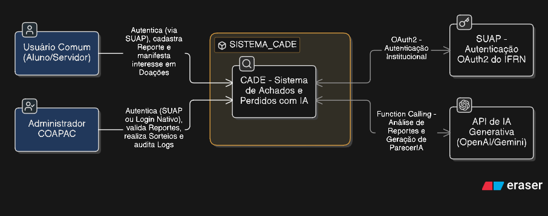
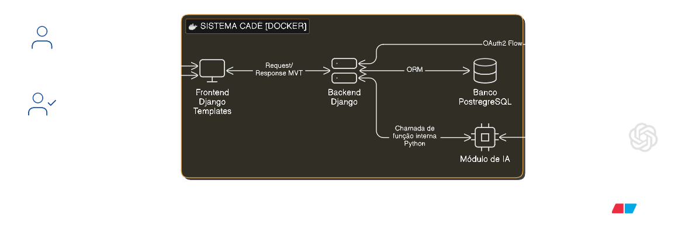
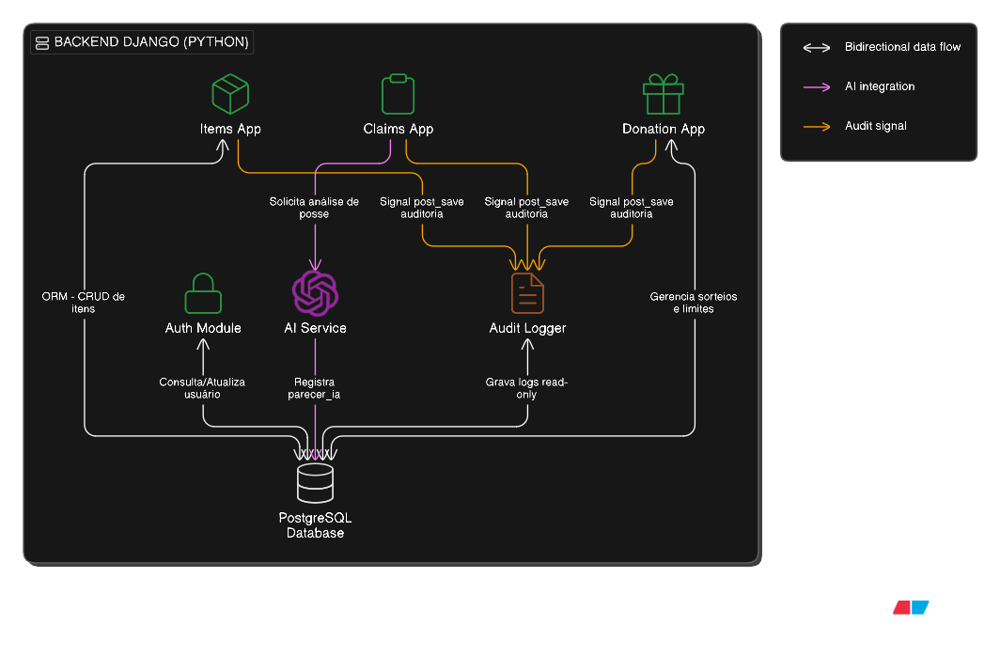
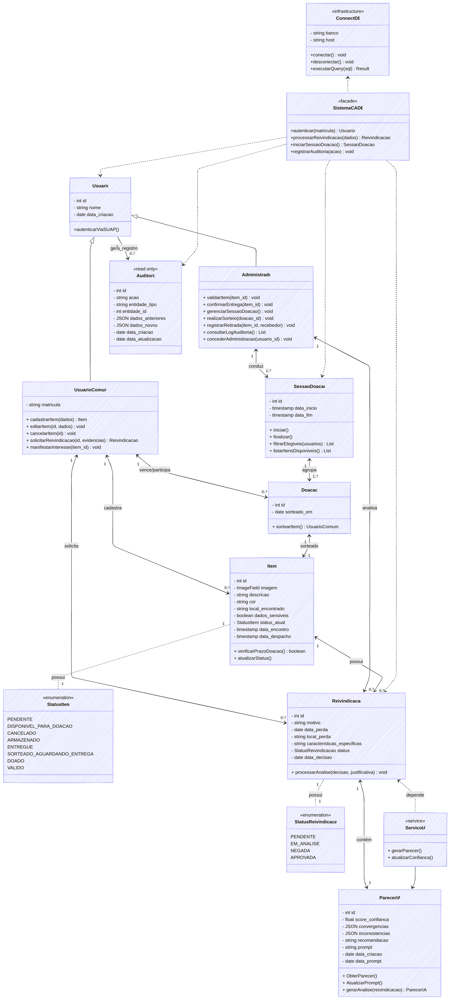
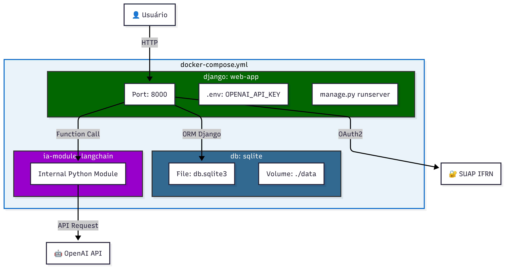

# Architecture Decision Record (ADR)

É um documento técnico, curto e estruturado, utilizado no desenvolvimento de software para registrar uma decisão importante sobre a arquitetura do sistema.

## Decisão técnica

**Status:** Em revisão. \
A arquitetura do sistema será baseada no framework Django (Python), utilizando PostgreeSQL para persistência dados e orquestração via Docker.


### Justificativa
O Django, sendo baseado em Python, oferece a melhor integração com as bibliotecas das APIs de IA (OpenAI/Gemini), facilitando o uso de Few-shot prompting e Function Calling. 
Além disso, possui suporte robusto para a integração com o provedor de identidade do SUAP (OAuth2).\
O padrão MVT (Model-View-Template) permite a criação rápida de interfaces responsivas e do formulário de reivindicação.\
Por fim, a stack permite a criação de um ambiente "plug-and-play", onde o sistema pode ser iniciado com um único comando, conforme as exigências de infraestrutura do projeto

---

# SUMÁRIO
1. [Diagrama de contexto](#diagrama-de-contexto-c4---nível-1)
2. [Diagrama de container](#diagrama-de-container-c4---nível-2)
3. [Diagrama de componentes](#diagrama-de-componentes-c4---nível-3)
4. [Diagrama de classes](#diagrama-de-classes)
5. [Diagrama de sequência](#diagrama-de-sequência---fluxo-de-reivindicação-com-ia)
6. [Diagrama de infraestrutura Docker](#diagrama-de-infraestrutura-docker)

---

## Diagrama de contexto (C4 - Nível 1)
> O Diagrama de Contexto é uma representação de alto nível que define as fronteiras do sistema. Ele **detalha** como o CADÊ **interage com os usuários** (Alunos, Servidores e Administradores) e com sistemas externos, como o SUAP para autenticação e as APIs de IA para validação.



```
C4Context
    title Diagrama de Contexto - Sistema CADÊ

    Person(aluno, "Aluno IFRN", "Consulta itens perdidos e cadastra itens encontrados")
    Person(servidor, "Servidor IFRN", "Consulta itens perdidos e cadastra itens encontrados")
    Person(admin, "Administrador COAPAC", "Valida itens, gerencia inventário e realiza sorteios")

    System_Boundary(cade, "Sistema CADÊ") {
        System(cade_system, "CADÊ", "Sistema de Achados e Perdidos com IA")
    }

    System_Ext(suap, "SUAP", "Sistema de Autenticação OAuth2 do IFRN")
    System_Ext(ia_api, "API de IA Generativa", "OpenAI/Gemini para validação inteligente")

    Rel(aluno, cade_system, "Autentica, consulta, cadastra e reivindica")
    Rel(servidor, cade_system, "Autentica, consulta, cadastra e reivindica")
    Rel(admin, cade_system, "Gerencia, valida, sorteia e audita")
    Rel(cade_system, suap, "OAuth2 - Autenticação Institucional")
    Rel(cade_system, ia_api, "Function Calling - Validação de Reivindicações")

    UpdateRelStyle(aluno, cade_system, $textColor="#0066CC", $lineColor="#0066CC")
    UpdateRelStyle(servidor, cade_system, $textColor="#0066CC", $lineColor="#0066CC")
    UpdateRelStyle(admin, cade_system, $textColor="#CC6600", $lineColor="#CC6600")
    UpdateRelStyle(cade_system, suap, $textColor="#666666", $lineColor="#666666", $offsetY="-30")
    UpdateRelStyle(cade_system, ia_api, $textColor="#666666", $lineColor="#666666", $offsetY="30")
```
---

## Diagrama de Container (C4 - Nível 2)
> O Diagrama de Container descreve a arquitetura lógica e a distribuição das responsabilidades tecnológicas. Ele apresenta como o sistema é dividido em **unidades executáveis** (Frontend, Backend, Banco de Dados e Módulo de IA) e como essas **partes se comunicam entre si** dentro do ambiente Docker.


```
C4Container
    title Diagrama de Container - Sistema CADÊ

    Person(aluno, "Aluno/Servidor", "Usuário comum do sistema")
    Person(admin, "Administrador COAPAC", "Gestor do inventário")

    System_Boundary(cade, "Sistema CADÊ [Docker]") {
        Container(frontend, "Frontend Django Templates", "HTML5 + Bootstrap 5 + JavaScript", "Interface responsiva renderizada pelo Django")
        Container(backend, "Backend Django", "Python + Django 5.x", "MVT, autenticação, regras de negócio e ORM")
        Container(db, "Banco PostgreSQL", "PostgreSQL 15", "Persistência de dados e logs de auditoria imutável")
        Container(ia_service, "Módulo de IA", "LangChain + OpenAI API", "Orquestração de prompts e Function Calling")
    }

    System_Ext(suap, "SUAP OAuth2", "Autenticação Institucional IFRN")
    System_Ext(openai, "OpenAI API", "GPT-4o-mini para análise textual")

    Rel(aluno, frontend, "Acessa via navegador (HTTP)")
    Rel(admin, frontend, "Acessa via navegador (HTTP)")
    Rel(frontend, backend, "Request/Response (MVT)")
    Rel(backend, db, "ORM Django - PostgreSQL")
    Rel(backend, ia_service, "Chamada de função interna (Python)")
    Rel(ia_service, openai, "API Request/Response")
    Rel(backend, suap, "OAuth2 Flow (python-social-auth)")

    UpdateRelStyle(frontend, backend, $textColor="#0066CC", $lineColor="#0066CC", $offsetX="-20")
    UpdateRelStyle(backend, db, $textColor="#009900", $lineColor="#009900", $offsetY="30")
    UpdateRelStyle(backend, ia_service, $textColor="#9900CC", $lineColor="#9900CC", $offsetX="40")
    UpdateRelStyle(ia_service, openai, $textColor="#9900CC", $lineColor="#9900CC", $offsetY="-30")

    UpdateElementStyle(frontend, $bgColor="#000", $borderColor="#333333")
    UpdateElementStyle(backend, $bgColor="#006600", $fontColor="#FFFFFF")
    UpdateElementStyle(db, $bgColor="#336791", $fontColor="#FFFFFF")
    UpdateElementStyle(ia_service, $bgColor="#9900CC", $fontColor="#FFFFFF")
```

---

## Diagrama de Componentes (C4 - Nível 3)
> O Diagrama de Componentes detalha a **organização interna do Backend** Django. Ele **identifica os módulos principais (Apps)** do sistema, como o gerenciamento de itens, o motor de sorteios e o serviço de auditoria, evidenciando as interações com o banco de dados e sinais internos do framework.



```
C4Component
    title Diagrama de Componentes - Backend Django CADÊ

    Container_Boundary(backend, "Backend Django (Python)") {
        Component(auth, "Auth Module", "python-social-auth + OAuth2", "Autenticação SUAP e gestão de sessões")
        Component(items, "Items App", "Django Models + Views", "CRUD de itens e validações (RF002-RF008)")
        Component(claims, "Claims App", "Django Models + Views", "Reivindicações e validação de posse (RF009)")
        Component(donation, "Donation App", "Django Models + Views", "Sorteios e gestão de doações (RF010-RF014)")
        Component(ai, "AI Service", "LangChain + OpenAI", "Prompts e Function Calling")
        Component(audit, "Audit Logger", "Django Signals + Models", "Log imutável de movimentações (RNF007, RF016)")
        ComponentDb(db, "PostgreSQL Database", "Tables: users, items, claims, donations, audit_logs")
    }

    Rel(auth, db, "Consulta/Atualiza usuário")
    Rel(items, db, "ORM - CRUD de itens")
    Rel(claims, ai, "Solicita análise de posse")
    Rel(ai, db, "Registra parecer_ia")
    Rel(donation, db, "Gerencia sorteios e limites")
    Rel(audit, db, "Grava logs read-only")
    Rel(items, audit, "Signal: post_save → auditoria")
    Rel(claims, audit, "Signal: post_save → auditoria")
    Rel(donation, audit, "Signal: post_save → auditoria")

    UpdateRelStyle(claims, ai, $textColor="#9900CC", $lineColor="#9900CC")
    UpdateRelStyle(ai, db, $textColor="#9900CC", $lineColor="#9900CC")
    UpdateRelStyle(audit, db, $textColor="#CC6600", $lineColor="#CC6600")

    UpdateElementStyle(auth, $bgColor="#006600", $fontColor="#FFFFFF")
    UpdateElementStyle(items, $bgColor="#006600", $fontColor="#FFFFFF")
    UpdateElementStyle(claims, $bgColor="#006600", $fontColor="#FFFFFF")
    UpdateElementStyle(donation, $bgColor="#006600", $fontColor="#FFFFFF")
    UpdateElementStyle(ai, $bgColor="#9900CC", $fontColor="#FFFFFF")
    UpdateElementStyle(audit, $bgColor="#CC6600", $fontColor="#FFFFFF")
```
---

## Diagrama de Classes
> O Diagrama de Classes descreve a estrutura estática e o modelo de dados do sistema. Ele define as **entidades** (Usuário, Item, Reivindicação, etc.), seus **atributos** e os **relacionamentos lógicos** (como herança e associação), garantindo que as regras de negócio e requisitos de integridade sejam respeitados.


```mmd
---
config:
  layout: dagre
  theme: default
  look: handDrawn
---
classDiagram 


    class UsuarioComum {
        - string matricula
        + cadastrarItem(dados) Item
        + editarItem(id, dados) void
        + cancelarItem(id) void
        + solicitarReivindicacao(id, evidencias) Reivindicacao
        + manifestarInteresse(item_id) void
 
    }

    class Administrador {
        + validarItem(item_id) void
        + confirmarEntrega(item_id) void
        + gerenciarSessaoDoacao() void
        + realizarSorteio(doacao_id) void
        + registrarRetirada(item_id, recebedor) void
        + consultarLogAuditoria() List
        + concederAdministracao(usuario_id) void

    }


    class StatusItem {
        <<enumeration>>
        PENDENTE
        DISPONIVEL_PARA_DOACAO
        CANCELADO
        ARMAZENADO
        ENTREGUE
        SORTEADO_AGUARDANDO_ENTREGA
        DOADO
        VALIDO
    }

    class Item{
        - int id
        - ImageField imagem
        - string descricao
        - string cor
        - string local_encontrado
        - boolean dados_sensiveis
        - StatusItem status_atual
        - timestamp data_encontro
        - timestamp data_despacho
        + verificarPrazoDoacao() boolean
        + atualizarStatus()

    }

    class Usuario{
        - int id
        - string nome
        - date data_criacao
        +autenticarViaSUAP()
    }

    class Doacao{
        - int id
        - date sorteado_em
        + sortearItem()  UsuarioComum
    }

    class SessaoDoacao{
        - int id
        - timestamp data_inicio
        - timestamp data_fim
        + iniciar()
        + finalizar()
        + filtrarElegiveis(usuarios) List
        + listarItensDisponiveis() List<Item>
    }

    class StatusReivindicacao {
        <<enumeration>>
        PENDENTE
        EM_ANALISE
        NEGADA
        APROVADA
        
    }

    class Reivindicacao{
        - int id
        - string motivo
        - date data_perda
        - string local_perda
        - string caracteristicas_especificas
        - StatusReivindicacao status
        - date data_decisao
        + processarAnalise(decisao, justificativa) void
        
    }

    class ServicoIA{
        <<service>>
        + gerarParecer()
        + atualizarConfianca()

    }

    class ParecerIA{
        - int id
        - float score_confianca
        - JSON convergencias
        - JSON inconsistencias
        - string recomendacao
        - string prompt
        - date data_criacao
        - date data_prompt
        + ObterParecer()
        + AtualizarPrompt()
        + gerarAnalise(reivindicacao) ParecerIA

    }

    class Auditoria{
        <<read only>>
        - int id
        - string acao
        - string entidade_tipo
        - int entidade_id
        - JSON dados_anteriores
        - JSON dados_novos
        - date data_criacao
        - date data_atualizacao
    }


    Usuario <|-- UsuarioComum
    Usuario <|-- Administrador
    Usuario "1" --> "0..*" Auditoria : gera_registro

    
    UsuarioComum "1" <--> "0..*" Item : cadastra
    UsuarioComum "1" <--> "0..*" Reivindicacao : solicita
    UsuarioComum "1" <--> "0..*" Doacao : vence/participa

    Administrador "1" <--> "1..*" SessaoDoacao :conduz
    Administrador "1" <--> "0..*" Reivindicacao : analisa
    Item "1" .. "1" StatusItem : possui
    Item "1" <--> "0..*" Reivindicacao : possui

    Reivindicacao "1" .. "1" StatusReivindicacao : possui
    Reivindicacao "1" <--> "1" ParecerIA :contém
    Reivindicacao <.. ServicoIA : depende
    

    SessaoDoacao "1" <--> "1..*" Doacao :agrupa

    Doacao "1" <--> "1" Item : sorteado

    ServicoIA --> ParecerIA
    


    class SistemaCADE {
        <<facade>>
        +autenticar(matricula) Usuario
        +processarReivindicacao(dados) Reivindicacao
        +iniciarSessaoDoacao() SessaoDoacao
        +registrarAuditoria(acao) void
    }
    
    class ConnectDB {
        <<infrastructure>>
        - string banco
        - string host
        +conectar() void
        +desconectar() void
        +executarQuery(sql) Result
    }

    ConnectDB <.. SistemaCADE
    SistemaCADE ..> Usuario
    SistemaCADE ..> Reivindicacao
    SistemaCADE ..> SessaoDoacao
    SistemaCADE ..> Auditoria

```
---

## Diagrama de Sequência - Fluxo de Reivindicação com IA 
> O Diagrama de Sequência ilustra a **interação dinâmica entre os componentes ao longo do tempo**. Ele detalha o passo a passo de um fluxo específico — neste caso, a reivindicação de um item com auxílio da IA — mostrando como as mensagens trafegam desde a interface do usuário até a tomada de decisão final.


```
sequenceDiagram
    autonumber
    participant U as Usuário Comum
    participant DT as Django Templates
    participant V as Django View
    participant M as Django Model
    participant IA as Serviço de IA
    participant DB as PostgreSQL
    participant A as Administrador

    U->>DT: Acessa /items/:id e clica "Reivindicar"
    DT->>V: GET /items/:id/
    V->>M: Item.objects.get(id)
    M->>DB: SELECT * FROM items WHERE id=?
    DB-->>M: Retorna item (status: Válido/Armazenado)
    M-->>V: Retorna item (dados sensíveis ocultos)
    V-->>DT: Renderiza template
    DT-->>U: Exibe formulário de reivindicação

    U->>DT: Preenche prova de posse + envia
    DT->>V: POST /claims/create/
    V->>M: Reivindicacao.objects.create()
    M->>DB: INSERT INTO claims...
    DB-->>M: Confirma salvamento

    V->>IA: analisa_reivindicacao(item, reivindicacao)
    note over IA: Remove dados sensíveis (RNF003)<br/>Aplica Few-shot Prompting
    IA->>IA: Gera score + convergências + inconsistências
    IA-->>V: Retorna dict Python estruturado
    V->>M: ParecerIA.objects.create()
    M->>DB: INSERT INTO parecer_ia...

    V-->>DT: Redirect /claims/success/
    DT-->>U: Exibe status "Em Análise"

    A->>DT: Acessa /admin/claims/
    DT->>V: GET /admin/claims/
    V->>M: Reivindicacao.objects.select_related('parecer_ia')
    M->>DB: SELECT com JOIN parecer_ia
    DB-->>M: Retorna reivindicações + parecer
    M-->>V: QuerySet com scores
    V-->>DT: Renderiza dashboard admin
    DT-->>A: Exibe parecer da IA + dados sensíveis

    A->>DT: Decide Aprovar/Rejeitar
    DT->>V: POST /admin/claims/:id/decision/
    V->>M: reivindicacao.status = 'Aprovada'
    M->>DB: UPDATE claims SET status=?
    M->>DB: INSERT INTO audit_logs... (imutável)
    DB-->>V: Confirma
    V-->>DT: Mensagem de sucesso
    DT-->>U: Notificação de decisão
```

---

## Diagrama de Infraestrutura Docker
> O Diagrama de Infraestrutura apresenta a topologia de implantação do sistema. Ele descreve como os **serviços são isolados** e **orquestrados em containers**, detalhando portas de rede, volumes de dados para persistência do SQLite e a comunicação com serviços em nuvem (APIs externas).


```
graph TB
    subgraph Docker_Compose["docker-compose.yml"]
        subgraph Django["django: web-app"]
            D1[Port: 8000]
            D2[.env: OPENAI_API_KEY]
            D3[manage.py runserver]
        end

        subgraph Database["db: sqlite"]
            S1[File: db.sqlite3]
            S2[Volume: ./data]
        end

        subgraph IA["ia-module: langchain"]
            I1[Internal Python Module]
        end
    end

    User[👤 Usuário] -->|HTTP| D1
    D1 -->|ORM Django| S1
    D1 -->|Function Call| I1
    I1 -->|API Request| OpenAI[🤖 OpenAI API]
    D1 -->|OAuth2| SUAP[🔐 SUAP IFRN]

    style Docker_Compose fill:#E8F4F8,stroke:#0066CC,stroke-width:2px
    style Django fill:#006600,stroke:#333,color:white
    style Database fill:#336791,stroke:#333,color:white
    style IA fill:#9900CC,stroke:#333,color:white
```
