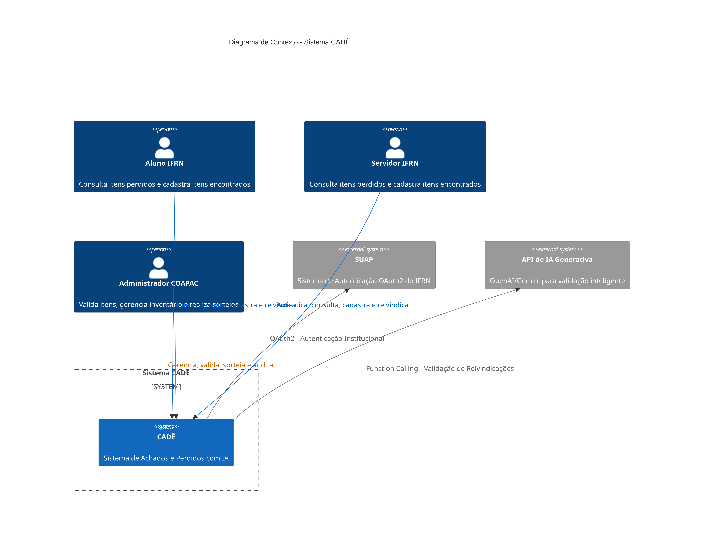
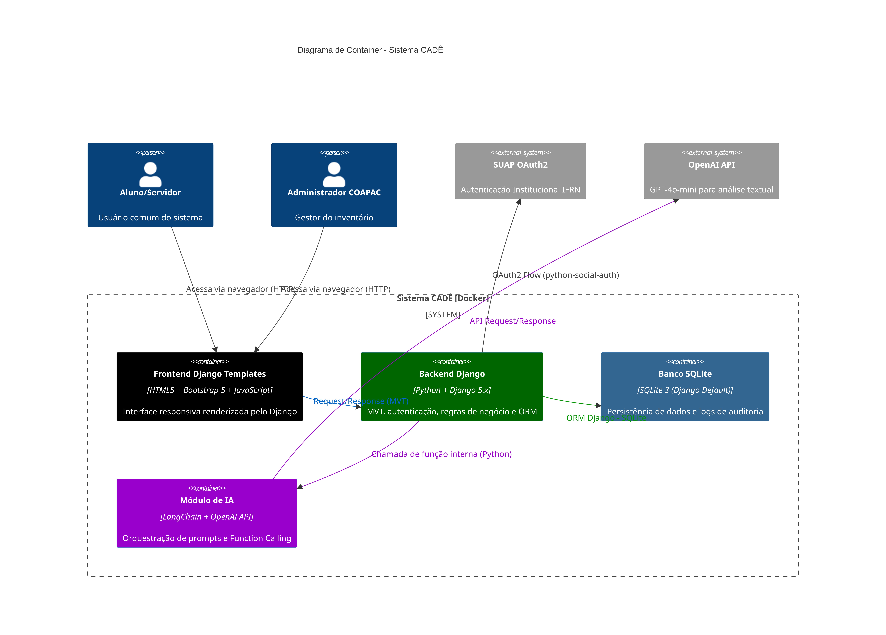
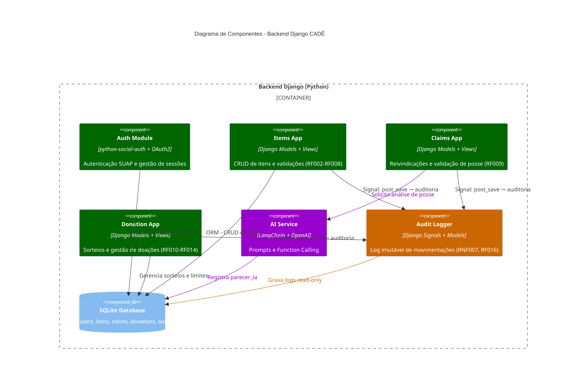

# Architecture Decision Record (ADR)

É um documento técnico, curto e estruturado, utilizado no desenvolvimento de software para registrar uma decisão importante sobre a arquitetura do sistema.

## Decisão técnica

**Status:** Em revisão. \
A arquitetura do sistema será baseada no framework Django (Python), utilizando SQLite para persistência local inicial e orquestração via Docker.
> Posteriormente, a equipe poderá migrar para o banco PostgreeSQL ou MySQL

### Justificativa
O Django, sendo baseado em Python, oferece a melhor integração com as bibliotecas das APIs de IA (OpenAI/Gemini), facilitando o uso de Few-shot prompting e Function Calling. 
Além disso, possui suporte robusto para a integração com o provedor de identidade do SUAP (OAuth2).\
O padrão MVT (Model-View-Template) permite a criação rápida de interfaces responsivas e do formulário de reivindicação.\
Por fim, a stack permite a criação de um ambiente "plug-and-play", onde o sistema pode ser iniciado com um único comando, conforme as exigências de infraestrutura do projeto

---

# SUMÁRIO
1. [Diagrama de contexto](#diagrama-de-contexto-c4---nível-1)
2. [Diagrama de container](#diagrama-de-container-c4---nível-2)
3. [Diagrama de componentes](#diagrama-de-componentes-c4---nível-3)
4. [Diagrama de classes](#diagrama-de-classes)
5. [Diagrama de sequência](#diagrama-de-sequência---fluxo-de-reivindicação-com-ia)
6. [Diagrama de infraestrutura Docker](#diagrama-de-infraestrutura-docker)

---

## Diagrama de contexto (C4 - Nível 1)


```
C4Context
    title Diagrama de Contexto - Sistema CADÊ

    Person(aluno, "Aluno IFRN", "Consulta itens perdidos e cadastra itens encontrados")
    Person(servidor, "Servidor IFRN", "Consulta itens perdidos e cadastra itens encontrados")
    Person(admin, "Administrador COAPAC", "Valida itens, gerencia inventário e realiza sorteios")

    System_Boundary(cade, "Sistema CADÊ") {
        System(cade_system, "CADÊ", "Sistema de Achados e Perdidos com IA")
    }

    System_Ext(suap, "SUAP", "Sistema de Autenticação OAuth2 do IFRN")
    System_Ext(ia_api, "API de IA Generativa", "OpenAI/Gemini para validação inteligente")

    Rel(aluno, cade_system, "Autentica, consulta, cadastra e reivindica")
    Rel(servidor, cade_system, "Autentica, consulta, cadastra e reivindica")
    Rel(admin, cade_system, "Gerencia, valida, sorteia e audita")
    Rel(cade_system, suap, "OAuth2 - Autenticação Institucional")
    Rel(cade_system, ia_api, "Function Calling - Validação de Reivindicações")

    UpdateRelStyle(aluno, cade_system, $textColor="#0066CC", $lineColor="#0066CC")
    UpdateRelStyle(servidor, cade_system, $textColor="#0066CC", $lineColor="#0066CC")
    UpdateRelStyle(admin, cade_system, $textColor="#CC6600", $lineColor="#CC6600")
    UpdateRelStyle(cade_system, suap, $textColor="#666666", $lineColor="#666666", $offsetY="-30")
    UpdateRelStyle(cade_system, ia_api, $textColor="#666666", $lineColor="#666666", $offsetY="30")
```
---

## Diagrama de Container (C4 - Nível 2)


```
C4Container
    title Diagrama de Container - Sistema CADÊ

    Person(aluno, "Aluno/Servidor", "Usuário comum do sistema")
    Person(admin, "Administrador COAPAC", "Gestor do inventário")

    System_Boundary(cade, "Sistema CADÊ [Docker]") {
        Container(frontend, "Frontend Django Templates", "HTML5 + Bootstrap 5 + JavaScript", "Interface responsiva renderizada pelo Django")
        Container(backend, "Backend Django", "Python + Django 5.x", "MVT, autenticação, regras de negócio e ORM")
        Container(db, "Banco SQLite", "SQLite 3 (Django Default)", "Persistência de dados e logs de auditoria")
        Container(ia_service, "Módulo de IA", "LangChain + OpenAI API", "Orquestração de prompts e Function Calling")
    }

    System_Ext(suap, "SUAP OAuth2", "Autenticação Institucional IFRN")
    System_Ext(openai, "OpenAI API", "GPT-4o-mini para análise textual")

    Rel(aluno, frontend, "Acessa via navegador (HTTP)")
    Rel(admin, frontend, "Acessa via navegador (HTTP)")
    Rel(frontend, backend, "Request/Response (MVT)")
    Rel(backend, db, "ORM Django - SQLite")
    Rel(backend, ia_service, "Chamada de função interna (Python)")
    Rel(ia_service, openai, "API Request/Response")
    Rel(backend, suap, "OAuth2 Flow (python-social-auth)")

    UpdateRelStyle(frontend, backend, $textColor="#0066CC", $lineColor="#0066CC", $offsetX="-20")
    UpdateRelStyle(backend, db, $textColor="#009900", $lineColor="#009900", $offsetY="30")
    UpdateRelStyle(backend, ia_service, $textColor="#9900CC", $lineColor="#9900CC", $offsetX="40")
    UpdateRelStyle(ia_service, openai, $textColor="#9900CC", $lineColor="#9900CC", $offsetY="-30")

    UpdateElementStyle(frontend, $bgColor="#000", $borderColor="#333333")
    UpdateElementStyle(backend, $bgColor="#006600", $fontColor="#FFFFFF")
    UpdateElementStyle(db, $bgColor="#336791", $fontColor="#FFFFFF")
    UpdateElementStyle(ia_service, $bgColor="#9900CC", $fontColor="#FFFFFF")
```

---

## Diagrama de Componentes (C4 - Nível 3)



```
C4Component
    title Diagrama de Componentes - Backend Django CADÊ

    Container_Boundary(backend, "Backend Django (Python)") {
        Component(auth, "Auth Module", "python-social-auth + OAuth2", "Autenticação SUAP e gestão de sessões")
        Component(items, "Items App", "Django Models + Views", "CRUD de itens e validações (RF002-RF008)")
        Component(claims, "Claims App", "Django Models + Views", "Reivindicações e validação de posse (RF009)")
        Component(donation, "Donation App", "Django Models + Views", "Sorteios e gestão de doações (RF010-RF014)")
        Component(ai, "AI Service", "LangChain + OpenAI", "Prompts e Function Calling")
        Component(audit, "Audit Logger", "Django Signals + Models", "Log imutável de movimentações (RNF007, RF016)")
        ComponentDb(db, "SQLite Database", "Tables: users, items, claims, donations, audit_logs")
    }

    Rel(auth, db, "Consulta/Atualiza usuário")
    Rel(items, db, "ORM - CRUD de itens")
    Rel(claims, ai, "Solicita análise de posse")
    Rel(ai, db, "Registra parecer_ia")
    Rel(donation, db, "Gerencia sorteios e limites")
    Rel(audit, db, "Grava logs read-only")
    Rel(items, audit, "Signal: post_save → auditoria")
    Rel(claims, audit, "Signal: post_save → auditoria")
    Rel(donation, audit, "Signal: post_save → auditoria")

    UpdateRelStyle(claims, ai, $textColor="#9900CC", $lineColor="#9900CC")
    UpdateRelStyle(ai, db, $textColor="#9900CC", $lineColor="#9900CC")
    UpdateRelStyle(audit, db, $textColor="#CC6600", $lineColor="#CC6600")

    UpdateElementStyle(auth, $bgColor="#006600", $fontColor="#FFFFFF")
    UpdateElementStyle(items, $bgColor="#006600", $fontColor="#FFFFFF")
    UpdateElementStyle(claims, $bgColor="#006600", $fontColor="#FFFFFF")
    UpdateElementStyle(donation, $bgColor="#006600", $fontColor="#FFFFFF")
    UpdateElementStyle(ai, $bgColor="#9900CC", $fontColor="#FFFFFF")
    UpdateElementStyle(audit, $bgColor="#CC6600", $fontColor="#FFFFFF")
```
---

## Diagrama de Classes


```
---
config:
  layout: elk
---
classDiagram
    class Usuario {
        +id: AutoField
        +matricula: CharField
        +nome: CharField
        +vinculo: CharField
        +email: EmailField
        +is_admin: BooleanField
        +created_at: DateTimeField
        +itens_cadastrados: ForeignKey[]
        +reivindicacoes: ForeignKey[]
        +doacoes_recebidas: ForeignKey[]
    }

    class Item {
        +id: AutoField
        +categoria: CharField
        +cor: CharField
        +local_encontro: CharField
        +observacoes: TextField
        +imagem: ImageField
        +status: CharField
        +dados_sensiveis: BooleanField
        +cadastro_por: ForeignKey
        +validado_por: ForeignKey
        +created_at: DateTimeField
        +updated_at: DateTimeField
    }

    class Reivindicacao {
        +id: AutoField
        +descricao_detalhada: TextField
        +data_perda: DateField
        +local_perda: CharField
        +caracteristicas_especificas: TextField
        +status: CharField
        +parecer_ia: OneToOneField
        +item: ForeignKey
        +reivindicante: ForeignKey
        +avaliado_por: ForeignKey
        +created_at: DateTimeField
    }

    class ParecerIA {
        +id: AutoField
        +score_confianca: IntegerField
        +convergencias: JSONField
        +inconsistencias: JSONField
        +recomendacao: TextField
        +prompt_usado: TextField
        +created_at: DateTimeField
    }

    class Doacao {
        +id: AutoField
        +item: ForeignKey
        +beneficiario: ForeignKey
        +sessao_doacao: CharField
        +sorteado_em: DateTimeField
        +limite_sessao: IntegerField
    }

    class AuditLog {
        +id: AutoField
        +acao: CharField
        +entidade: CharField
        +entidade_id: IntegerField
        +usuario_responsavel: ForeignKey
        +dados_anteriores: JSONField
        +dados_novos: JSONField
        +created_at: DateTimeField
        +read_only: BooleanField
    }

    Usuario "1" -- "0..*" Item : cadastra
    Usuario "1" -- "0..*" Reivindicacao : realiza
    Usuario "1" -- "0..*" Doacao : recebe
    Item "1" -- "0..*" Reivindicacao : possui
    Reivindicacao "1" -- "0..1" ParecerIA : contém
    Item "1" -- "0..*" AuditLog : gera
    Reivindicacao "1" -- "0..*" AuditLog : gera
    Doacao "1" -- "0..*" AuditLog : gera

    note for AuditLog "RNF007: Registros são\nread-only após criação"
    note for Item "RF007: Status muda apenas\npor administrador"
    note for ParecerIA "Nível Intermediário:\nFunction Calling"
```
---

## Diagrama de Sequência - Fluxo de Reivindicação com IA 


```
---
config:
  look: neo
---
sequenceDiagram
    autonumber
    participant U as Usuário Comum
    participant DT as Django Templates
    participant V as Django View
    participant M as Django Model
    participant IA as Serviço de IA
    participant DB as SQLite
    participant A as Administrador

    U->>DT: Acessa /items/:id e clica "Reivindicar"
    DT->>V: GET /items/:id/
    V->>M: Item.objects.get(id)
    M->>DB: SELECT * FROM items WHERE id=?
    DB-->>M: Retorna item (status: Válido/Armazenado)
    M-->>V: Retorna item (dados sensíveis ocultos)
    V-->>DT: Renderiza template
    DT-->>U: Exibe formulário de reivindicação

    U->>DT: Preenche prova de posse + envia
    DT->>V: POST /claims/create/
    V->>M: Reivindicacao.objects.create()
    M->>DB: INSERT INTO claims...
    DB-->>M: Confirma salvamento

    V->>IA: analisa_reivindicacao(item, reivindicacao)
    note over IA: Remove dados sensíveis (RNF003)<br/>Aplica Few-shot Prompting
    IA->>IA: Gera score + convergências + inconsistências
    IA-->>V: Retorna dict Python estruturado
    V->>M: ParecerIA.objects.create()
    M->>DB: INSERT INTO parecer_ia...

    V-->>DT: Redirect /claims/success/
    DT-->>U: Exibe status "Em Análise"

    A->>DT: Acessa /admin/claims/
    DT->>V: GET /admin/claims/
    V->>M: Reivindicacao.objects.select_related('parecer_ia')
    M->>DB: SELECT com JOIN parecer_ia
    DB-->>M: Retorna reivindicações + parecer
    M-->>V: QuerySet com scores
    V-->>DT: Renderiza dashboard admin
    DT-->>A: Exibe parecer da IA + dados sensíveis

    A->>DT: Decide Aprovar/Rejeitar
    DT->>V: POST /admin/claims/:id/decision/
    V->>M: reivindicacao.status = 'Aprovada'
    M->>DB: UPDATE claims SET status=?
    M->>DB: INSERT INTO audit_logs... (imutável)
    DB-->>V: Confirma
    V-->>DT: Mensagem de sucesso
    DT-->>U: Notificação de decisão
```

---

## Diagrama de Infraestrutura Docker


```
graph TB
    subgraph Docker_Compose["docker-compose.yml"]
        subgraph Django["django: web-app"]
            D1[Port: 8000]
            D2[.env: OPENAI_API_KEY]
            D3[manage.py runserver]
        end

        subgraph Database["db: sqlite"]
            S1[File: db.sqlite3]
            S2[Volume: ./data]
        end

        subgraph IA["ia-module: langchain"]
            I1[Internal Python Module]
        end
    end

    User[👤 Usuário] -->|HTTP| D1
    D1 -->|ORM Django| S1
    D1 -->|Function Call| I1
    I1 -->|API Request| OpenAI[🤖 OpenAI API]
    D1 -->|OAuth2| SUAP[🔐 SUAP IFRN]

    style Docker_Compose fill:#E8F4F8,stroke:#0066CC,stroke-width:2px
    style Django fill:#006600,stroke:#333,color:white
    style Database fill:#336791,stroke:#333,color:white
    style IA fill:#9900CC,stroke:#333,color:white
```